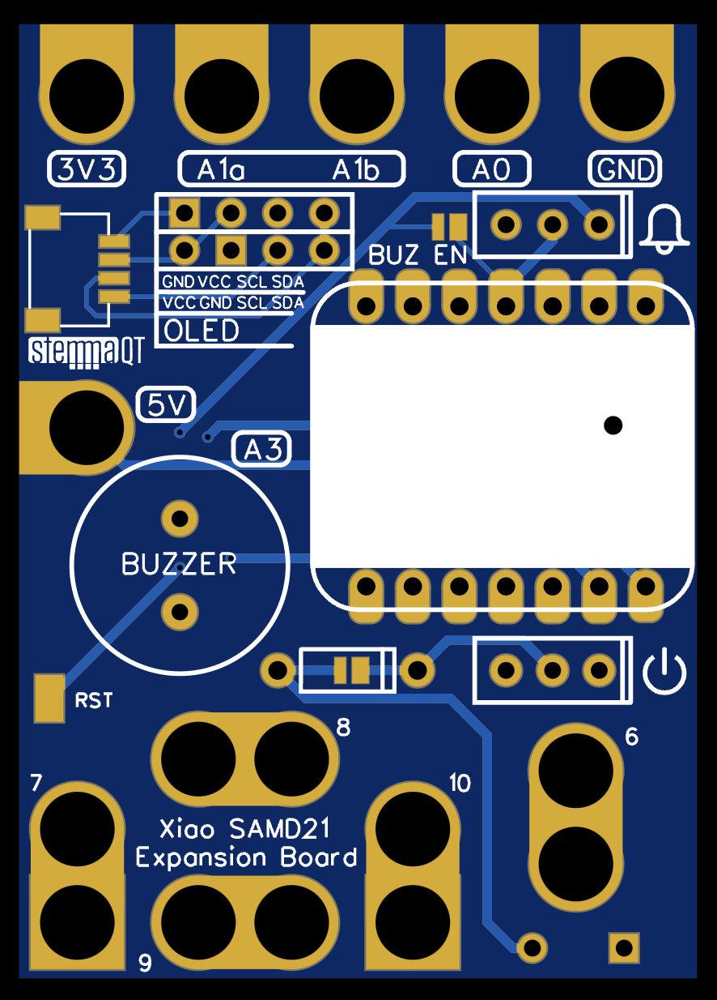

# Seeeduino Xiao Expansion Board

A handy expansion board for seeeduino xiao (M0)

# Hardware

[EasyEDA link](https://oshwlab.com/urfdvw/sensor-camp_copy_copy_copy_copy_copy_copy_copy_copy_copy_copy_copy_copy_copy_copy_copy)

# What is on the board

- Aligator clip holes
    - A1(a, b), A0, A6 ~ A10
    - Power
        - Gnd
        - 3.3v
        - 5v
- Touch buttons
    - A1(a, b), A0, A6 ~ A10
- OLED Screen connectors (SCL, SDA)
    - For two pin definitions
- StemmaQT 
    - share the same I2C with OLED
- Buzzer (A3)
    - can be connected by soldering connection
    - can be connected/disconnected by slide switch
- Battery
    - 3 * AAA battery case
    - power switch
    - diode prevent charging
- Reset Pad
    - GND pad on the back

Solder the compoments accoding to the need.

# Code in the repository
- CircuitPython
    - scr: files before compiling
    - release: files to be copied to Xiao
    - examples: some sensor examples
- Arduino
    - TODO: sensor interface code