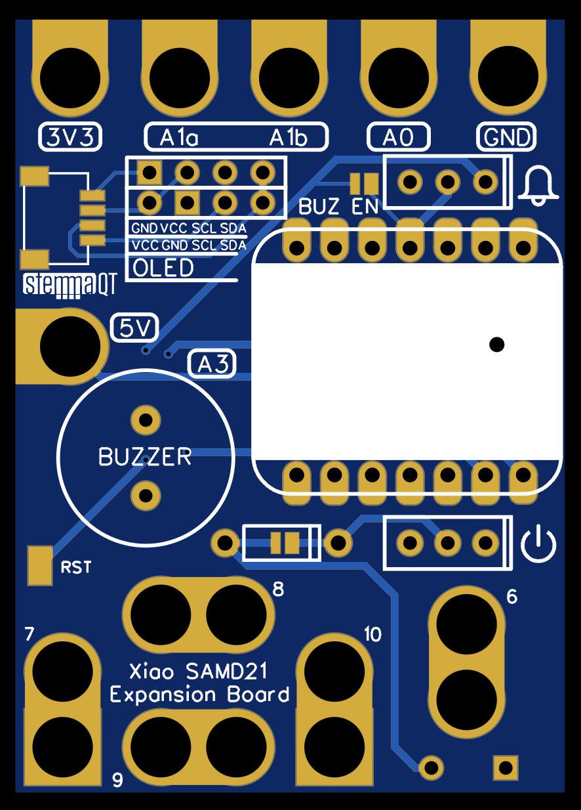

# XiaoExp: A handy expansion board for seeeduino xiao (M0)

# Motivation

This project aims to provide a cheap and flexible solution for in-class entry-level microcontroller education.
To show the feature of this board,
[Circuit Playground Express](https://www.adafruit.com/product/3333) board from Adafruit is used for comparison.

In common
- targeting the same student level
- featuring the same SAMD21 microcontroller.
- Pads and holes that are designed to be used for alligator clips and also touch.
- battery support
- StemmaQT support

Difference
- XiaoExp + Xiao is way cheaper.
- XiaoExp only has any basic IO peripherals (touch buttons, an OLED screen, and a buzzer), while Circuit Playground has a variety of peripherals.
    - Instructors can choose which peripherals to solder on the XiaoExp board.
    - Instructors can choose which other peripherals to add to the experiment kit.
- XiaoExp prefers OLED over RGB LEDs to show more information
- XiaoExp prioritizes touch buttons over alligator clips.
    - XiaoExp has a better layout for touch navigation.
- All components on the XiaoExp are through-hole instead of surface-mount.
    - Students with minimum soldering experience can make one on their own.
- Female headers are used on the Xiao for connecting DuPont jumper wires to modules or breadboard circuits.
    - The female headers also serve as support for the OLED screen
- XiaoExp uses 3 AAA batteries instead of LiPo.
    - The reason for this is to simplify the preparation of the experiment kit.
- XiaoExp is a rectangle and the same size as a 3 AAA battery case.
    - When gluing the battery case on the back, the device is very compact.

# Hardware

[EasyEDA link](https://oshwlab.com/urfdvw/sensor-camp_copy_copy_copy_copy_copy_copy_copy_copy_copy_copy_copy_copy_copy_copy_copy)

## What is on the board

- Aligator clip holes
    - A1(a, b), A0, A6 ~ A10
    - Power
        - Gnd
        - 3.3v
        - 5v
- Touch buttons
    - A1(a, b), A0, A6 ~ A10
- OLED Screen connectors (SCL, SDA)
    - For two pin definitions
- StemmaQT 
    - share the same I2C with OLED
- Buzzer (A3)
    - can be connected by soldering connection
    - can be connected/disconnected by slide switch
- Battery
    - 3 * AAA battery case
    - power switch
    - diode prevent charging

Solder the compoments accoding to the need.

# Code in the repository
- CircuitPython
    - scr: files before compiling
    - release: files to be copied to Xiao
    - examples: some sensor examples
- Arduino
    - TODO: sensor interface code

## I2C 1306 Screen CircuitPython Library
Usually, in SAMD21 + CircuitPython projects,
screens are not recommended,
because `diaplayio` module is too big for the SAMD21 microcontrollers.
In this repository, 
I provided [a slimdown version for SSD1306 OLED screen](./CircuitPython/src/ssd1306.py).
Its [compiled .mpy version](./CircuitPython/release/release/lib/ssd1306.mpy) can run on SAMD21 with very small memery usage.
It can only display text,
not images.

Please see the [source code](./CircuitPython/src/ssd1306.py) for details.

TODO: Document for the library.